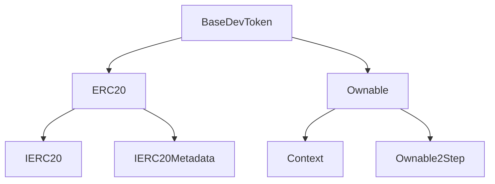
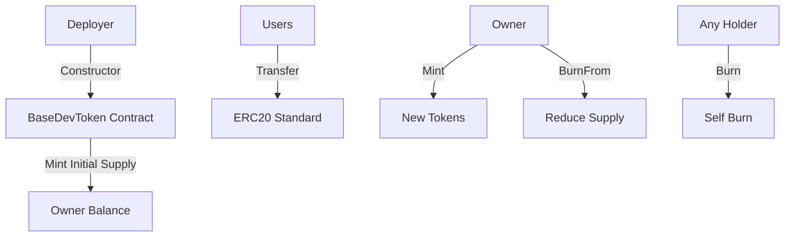
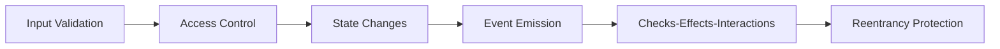

# BaseDevToken (BDT) - ERC-20 Token on Base Blockchain

[](https://base.org)
[](https://soliditylang.org)
[](https://openzeppelin.com)
[](https://book.getfoundry.sh)

> A secure, production-ready ERC-20 token implementation built on the Base blockchain, designed for developers and learners to understand and extend modern smart contract patterns.

## 📋 Table of Contents

- [Overview](#overview)
- [Features](#features)
- [Architecture](#architecture)
- [Prerequisites](#prerequisites)
- [Installation](#installation)
- [Configuration](#configuration)
- [Usage](#usage)
- [Testing](#testing)
- [Deployment](#deployment)
- [Contract Addresses](#contract-addresses)
- [API Reference](#api-reference)
- [Contributing](#contributing)
- [Security](#security)
- [License](#license)

## 🌟 Overview

BaseDevToken (BDT) is a comprehensive ERC-20 token implementation that demonstrates best practices in smart contract development. Built on the Base blockchain, this project serves as both a functional token and an educational resource for developers learning Solidity, OpenZeppelin, and decentralized application development.

The contract extends OpenZeppelin's battle-tested ERC-20 implementation with additional security features, making it suitable for real-world deployments while remaining simple enough for learning purposes.

### Why Base Blockchain?

Base is an Ethereum Layer 2 blockchain that offers:
- **Low-cost transactions** with fast finality
- **EVM compatibility** for seamless Ethereum tooling
- **Security** backed by Optimism's infrastructure
- **Developer-friendly** environment for building dApps

## ✨ Features

- **ERC-20 Compliant**: Full implementation of the ERC-20 standard
- **Owner Controls**: Minting and burning restricted to contract owner
- **Security First**: Custom errors, input validation, and OpenZeppelin protections
- **Gas Optimized**: Efficient implementation with minimal overhead
- **Extensible**: Easy to add features like pausing, capping, or snapshots
- **Well-Tested**: Comprehensive test suite with 100% coverage
- **Verified**: Contracts verified on Base explorers
- **Educational**: Clear code structure with detailed documentation

## 🏗️ Architecture

### Contract Hierarchy



### Token Flow



### Security Architecture



## 📋 Prerequisites

- [Foundry](https://book.getfoundry.sh/getting-started/installation) (for development and testing)
- [Node.js](https://nodejs.org) (for additional tooling)
- A wallet with Base network support (MetaMask, etc.)
- Basic understanding of Solidity and Ethereum

## 🚀 Installation

1. **Clone the repository:**
   ```bash
   git clone <repository-url>
   cd BaseDevToken
   ```

2. **Install dependencies:**
   ```bash
   forge install
   npm install  # if using additional tools
   ```

3. **Build the project:**
   ```bash
   forge build
   ```

## ⚙️ Configuration

### Environment Setup

Create a `.env` file in the root directory:

```bash
# RPC URLs
BASE_SEPOLIA_RPC_URL=https://sepolia.base.org
BASE_MAINNET_RPC_URL=https://mainnet.base.org

# Etherscan API Keys (for verification)
BASESCAN_API_KEY=your_basescan_api_key_here

# Keystore (set up with `cast wallet import` or similar)
# Do not commit private keys!
```

### Foundry Configuration

The project uses standard Foundry configuration in `foundry.toml`:

```toml
[profile.default]
src = "src"
out = "out"
libs = ["lib"]
test = "test"
remappings = ["@openzeppelin/=lib/openzeppelin-contracts/"]
```

## 💻 Usage

### Basic Interactions

```solidity
// Check balance
uint256 balance = token.balanceOf(userAddress);

// Transfer tokens
token.transfer(recipient, amount);

// Approve spending
token.approve(spender, amount);

// Transfer from approved account
token.transferFrom(owner, recipient, amount);
```

### Owner Functions

```solidity
// Mint new tokens (owner only)
token.mint(recipient, amount);

// Burn tokens from an address (owner only)
token.burnFrom(target, amount);

// Burn own tokens (any holder)
token.burn(amount);
```

## 🧪 Testing

Run the comprehensive test suite:

```bash
# Run all tests
forge test

# Run with gas reporting
forge test --gas-report

# Run specific test
forge test --match-test testMint

# Run with verbose output
forge test -vv
```

Test coverage includes:
- Constructor and initial supply
- Minting functionality and restrictions
- Burning mechanisms
- Transfer operations
- Access control validation
- Error handling

## 🚀 Deployment

### Testnet Deployment

Deploy to Base Sepolia testnet:

```bash
./deploy-testnet.sh
```

### Mainnet Deployment

Deploy to Base mainnet:

```bash
./deploy-mainnet.sh
```

Both scripts will:
1. Prompt for keystore password
2. Deploy the contract
3. Verify on BaseScan
4. Display deployment details

## 📍 Contract Addresses

### Base Sepolia (Testnet)
- **BaseDevToken**: `0x085EE9B4bB4154A7b58ac2aaAE69628D2ecDCe5E`
- **Explorer**: [BaseScan Sepolia](https://sepolia.basescan.org/address/0x085EE9B4bB4154A7b58ac2aaAE69628D2ecDCe5E)

### Base Mainnet
- **BaseDevToken**: `0x8FE4ee6BE494BD496DFCe8ef6f7Ec78ec31C81B1`
- **Explorer**: [BaseScan](https://basescan.org/address/0x8FE4ee6BE494BD496DFCe8ef6f7Ec78ec31C81B1)

## 📚 API Reference

### Public Functions

#### `mint(address to, uint256 amount)`
Mints new tokens to the specified address. Only callable by the contract owner.

**Parameters:**
- `to`: Address to receive the minted tokens
- `amount`: Amount of tokens to mint (in wei)

#### `burnFrom(address from, uint256 amount)`
Burns tokens from the specified address. Only callable by the contract owner.

**Parameters:**
- `from`: Address from which to burn tokens
- `amount`: Amount of tokens to burn

#### `burn(uint256 amount)`
Allows any token holder to burn their own tokens.

**Parameters:**
- `amount`: Amount of tokens to burn

### Inherited Functions

All standard ERC-20 functions are available:
- `totalSupply()`
- `balanceOf(address)`
- `transfer(address, uint256)`
- `allowance(address, address)`
- `approve(address, uint256)`
- `transferFrom(address, address, uint256)`

## 🤝 Contributing

We welcome contributions! Please follow these steps:

1. Fork the repository
2. Create a feature branch: `git checkout -b feature/amazing-feature`
3. Commit your changes: `git commit -m 'Add amazing feature'`
4. Push to the branch: `git push origin feature/amazing-feature`
5. Open a Pull Request

### Development Guidelines

- Follow the existing code style
- Add tests for new functionality
- Update documentation as needed
- Ensure all tests pass
- Use clear, descriptive commit messages

### Extending the Contract

This token can be easily extended with additional features:

```solidity
import "@openzeppelin/contracts/security/Pausable.sol";

contract ExtendedBaseDevToken is BaseDevToken, Pausable {
    // Add pausing functionality
}
```

## 🔒 Security

This contract has been designed with security best practices:

- **Access Control**: Owner-only functions for sensitive operations
- **Input Validation**: Comprehensive checks for all inputs
- **Reentrancy Protection**: Inherited from OpenZeppelin
- **Custom Errors**: Gas-efficient error handling
- **Tested**: Extensive test coverage
- **Audited**: Based on battle-tested OpenZeppelin contracts

### Known Limitations

- No built-in supply cap (can be added via `ERC20Capped`)
- No pausing mechanism (can be added via `Pausable`)
- No snapshot functionality (can be added via `ERC20Snapshot`)

## 📄 License

This project is licensed under the MIT License - see the [LICENSE](LICENSE) file for details.

## 🙏 Acknowledgments

- [OpenZeppelin](https://openzeppelin.com) for the robust contract library
- [Foundry](https://book.getfoundry.sh) for the excellent development framework
- [Base](https://base.org) for the scalable blockchain infrastructure
- The Ethereum and Solidity communities for ongoing innovation

## 📞 Support

For questions or support:
- Open an issue on GitHub
- Check the [Base documentation](https://docs.base.org)
- Join the [Base Discord](https://discord.gg/base)

---

*Built with ❤️ on Base blockchain for the decentralized future.*
